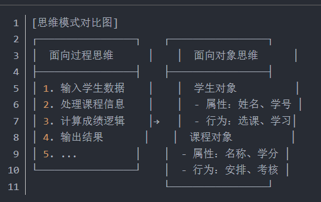

# 概念

## 面向过程

```c
/ 点灯
void main()
{
    while (1)
    {
        led_on();
        delay_ms(500);
        led_off();
        delay_ms(500);
    }
}
```

在 main 函数中是一个 while 循环，首先调用 led_on()函数点亮 LED，然后延迟一阵子，接着调用 led_off()熄灭 LED，最后延迟一阵子。

这个程序就是面向过程的，它的编程方法是：先分析出解决问题所需的步骤，然后针对每一步骤编写函数，最后依次调用这些函数。

## 面向对象

```c
// 点灯
struct led
{
    void (*on)(void);
    void (*off)(void);
};

static ra_led_on(void)
{
    // 点亮 LED
}

static ra_led_off(void)
{
    // 熄灭 LED
}

static struct led g_led = {
    .on = ra_led_on,
    .off = ra_led_off,
};

void main()
{
    while (1)
    {
        g_led.on();
        delay_ms(500);
        g_led.off();
        delay_ms(500);
    }
}

```

* 第 2~5 行:对于 LED，它是一个“对象”，抽象出一个结构体“struct led”，里面有 2 个函数指针。
* 第 18~19 行，定义了一个结构体变量 g_led，填充了结构体里的 2 个函数指针，让它们指向具体的函数。
* 第 23 行开始的 main 函数，跟面向过程的 main 函数类似，只不过操作 LED 时是调用结构体 g_led 的函数指针。

上述程序就是面向对象的，它的编程方法是：把问题中的事务分解成各个对象，在对象里描述事务的属性、行为，最后使用对象来解决问题。

# 区别

使用面向过程编写程序时，符合人类的认知过程，比较自然。它的效率也比较高，因为省去了结构体的初始化，调用函数时也比较直接，无需通过结构体进行调用。

使用面向过程编写程序时，更容易维护、复用、扩展。

使用面向对象的思想，把硬件的操作封装在一个结构体里，甚至把一个业务的操作封装在一个结构体里。初次接触这种风格的代码时，不容易理解。特别是在比较复杂的系统里，这些封装的层次更多，层层封装和多次跳转之下程序更难理解。但是一旦理解之后，就会发现程序设计的精妙。一旦习惯了面向对象的编程方法，你就不会再使用面向过程的编程方法。



# 四大支柱

## 抽象

核心思想：隐藏复杂性，只暴露必要的部分。

就像开车，你只需要知道方向盘、油门、刹车怎么用，而不需要懂发动机的工作原理。

编程体现：我们创建一个学生类。我们只关心学生的相关属性（如姓名、学号、年级）和相关行为（如选课、做作业、查询成绩）。我们不关心学生的心脏如何跳动这种无关细节。

作用：简化世界，让我们能专注于核心问题。

```c
[抽象概念图]
┌─────────────────────────────────────────┐
│          现实世界的学生 (复杂性)          │
│ ┌─────────────────────────────────────┐ │
│ │ 姓名、年龄、身高、体重、爱好、家庭地址... │ │
│ │ 走路、吃饭、睡觉、思考、社交、学习...   │ │
│ └─────────────────────────────────────┘ │
└─────────────────────────────────────────┘
                      ↓ 抽象：提取相关特征
┌─────────────────────────────────────────┐
│          程序中的学生类 (简化模型)         │
│ ┌─────────────────────────────────────┐ │
│ │ 属性：姓名、学号、年级、成绩           │ │
│ │ 行为：选课、学习、考试、查询成绩       │ │
│ └─────────────────────────────────────┘ │
└─────────────────────────────────────────┘
```

## 封装

核心思想：把数据（属性）和操作数据的方法（行为）捆绑在一起，并控制对内部数据的访问。

就像一个“保险箱”。钱（数据）放在里面，你只能通过特定的锁孔（方法）来存钱或取钱，不能直接把手伸进去拿。

编程体现：学生对象的“成绩”属性通常是私有的。你不能直接 student.grade = 100这样随意修改。你必须通过一个公共方法，比如 student.submitAssignment(assignment, score)来间接修改，这个方法内部可能还有验证逻辑（比如分数不能为负）。

作用：提高安全性、可维护性，内部实现改变了，只要方法接口不变，就不会影响其他代码。

```c
[封装概念图：像保险箱一样保护数据]
┌─────────────────────────────────────────┐
│             学生对象 (保险箱)             │
│  ┌─────────────────────────────────────┐ │
│  │        私有数据：__grade = 90       │ │
│  │ ┌─────────────────────────────────┐ │ │
│  │ │       公共方法 (锁孔)           │ │ │
│  │ │  setGrade(score) ← 安全入口      │ │ │
│  │ │  getGrade()     ← 安全出口        │ │ │
│  │ └─────────────────────────────────┘ │ │
│  └─────────────────────────────────────┘ │
│  直接访问：student.__grade = 100 ❌ 错误! │
│  安全访问：student.setGrade(100) ✅ 正确! │
└─────────────────────────────────────────┘
```

## 继承

核心思想：基于已有的类创建新类，新类自动拥有父类的属性和方法，并可以添加自己特有的内容。

就像“遗传”。博士生是一种特殊的学生，他拥有学生的所有特征（姓名、学号），但可能还有自己独特的特征（如导师、研究课题）。

编程体现：我们可以创建一个博士生类，让它继承自学生类。这样博士生就自动拥有了姓名、选课等方法，我们只需要为它定义额外的属性和方法即可。

作用：代码复用，避免重复。可以建立清晰的层次结构。

```c
[继承关系：家族树]
                ┌─────────────────┐
                │      Person     │  ← 基类/父类
                │  - name        │    通用特征
                │  - age         │
                │  + speak()     │
                └─────────────────┘
                         △
            ┌────────────┴────────────┐
            │                         │
    ┌─────────────────┐      ┌─────────────────┐
    │     Student     │      │     Teacher     │  ← 派生类/子类
    │  - studentId    │      │  - teacherId    │    特有特征
    │  + study()      │      │  + teach()      │
    └─────────────────┘      └─────────────────┘
            △                         △
            │                         │
┌─────────────────────────┐ ┌─────────────────────┐
│   GraduateStudent       │ │   SeniorTeacher      │
│  - supervisor          │ │  - department        │  ← 更具体的子类
│  + doResearch()        │ │  + manageTeam()      │
└─────────────────────────┘ └─────────────────────┘
```

## 多态

核心思想：同一操作作用于不同的对象，可以产生不同的执行结果。

简单说就是“同一接口，不同实现”。

编程体现：学校系统里既有本科生也有研究生，它们都继承自学生类，都有一个计算学费的方法。但本科生和研究生的学费计算规则完全不同。

当系统通知所有学生计算学费时，它只需要统一调用 student.calculateTuition()。

对于本科生对象，这个方法会执行本科生的计算逻辑。

对于研究生对象，则会执行研究生的计算逻辑。

作用：提高代码的灵活性和可扩展性。添加新的学生类型（如交换生）时，无需修改调用方的代码。

```c
[多态：同一方法，不同行为]
┌─────────────────────────────────────────┐
│         客户端代码 (统一调用)              │
│  student.calculateTuition()             │
└─────────────────────────────────────────┘
                      ↓
    ┌─────────────────┬─────────────────┐
    │                 │                 │
┌─────────┐       ┌─────────┐       ┌─────────┐
│本科生对象 │       │研究生对象 │       │交换生对象 │
│ tuition =│       │ tuition =│       │ tuition =│
│ 5000*学分 │       │ 8000*学分 │       │ 3000*学分 │
└─────────┘       └─────────┘       └─────────┘
    │                 │                 │
    └─────────────────┴─────────────────┘
                      ↓
┌─────────────────────────────────────────┐
│       不同结果，但调用方式相同              │
│  - 本科生：计算本科收费标准               │
│  - 研究生：计算研究生收费标准             │
│  - 交换生：计算交换生收费标准             │
└─────────────────────────────────────────┘
```

## 封装实现

### 实现思想

用模块（.c + .h）、静态变量、结构体 + 函数组合来隐藏实现细节，只暴露必要接口给外部。

也就是：

对外暴露函数接口（API）
隐藏内部数据/函数（不放进 .h，或使用 static）
外部代码不能直接访问内部细节
这就是封装，只不过不靠关键字，而靠“文件隔离 + static”。

**Account.h     ← 对外暴露接口（公共 API）
Account.c     ← 内部实现（封装）
main.c      ← 外部使用者代码**

### 举例

#### Account.h（公共接口 — 对外暴露）

```c
// Account.h
 
#ifndef ACCOUNT_H
#define ACCOUNT_H
 
// 只声明，不暴露内部字段
typedef struct Account Account;
 
/**
 * 创建账户
 */
Account* Account_create(double initial);
 
/**
 * 销毁账户
 */
void Account_destroy(Account* acc);
 
/**
 * 存钱
 */
void Account_deposit(Account* acc, double amount);
 
/**
 * 取钱
 */
void Account_withdraw(Account* acc, double amount);
 
/**
 * 获取余额
 */
double Account_getBalance(const Account* acc);
 
#endif
```

#### Account.c（内部实现 — 封装部分）

```c
// Account.c
 
#include "Account.h"
#include <stdio.h>
#include <stdlib.h>
 
// 真正的结构体定义（隐藏在 .c 文件中）
struct Account {
    double balance;
};
 
// 内部的工具函数（私有），外面看不到
static void print_log(const char* msg) {
    printf("[Account Log]: %s\n", msg);
}
 
Account* Account_create(double initial) {
    if (initial < 0) initial = 0;
 
    Account* acc = (Account*)malloc(sizeof(Account));
    acc->balance = initial;
 
    print_log("Account created");
    return acc;
}
 
void Account_destroy(Account* acc) {
    print_log("Account destroyed");
    free(acc);
}
 
void Account_deposit(Account* acc, double amount) {
    if (amount > 0) {
        acc->balance += amount;
        print_log("Deposit success");
    }
}
 
void Account_withdraw(Account* acc, double amount) {
    if (amount > 0 && amount <= acc->balance) {
        acc->balance -= amount;
        print_log("Withdraw success");
    }
}
 
double Account_getBalance(const Account* acc) {
    return acc->balance;
}
```

**关键点：**

- `struct Account` 的字段只有本文件能看到 → **完全封装**
- `print_log()` 是 `static` → **模块私有**
- 外部无法直接操作 `balance`
- 所有访问都通过函数进行 → **受控访问**

#### main.c（外部用户代码 — 使用封装好的模块）

```c
// main.c
 
#include <stdio.h>
#include "Account.h"
 
int main() {
    Account* acc = Account_create(100);
 
    printf("初始余额: %.2f\n", Account_getBalance(acc));
 
    Account_deposit(acc, 50);
    printf("存钱后余额: %.2f\n", Account_getBalance(acc));
 
    Account_withdraw(acc, 30);
    printf("取钱后余额: %.2f\n", Account_getBalance(acc));
 
    // ❌ 下面这行做不到：因为结构体字段被封装
    // acc->balance = 9999; // 编译错误
 
    Account_destroy(acc);
    return 0;
}
```

## 抽象思想

### 核心思想

- **用户只看到接口，不看到实现。**
- **通过不透明结构体（Opaque Struct）隐藏内部细节。**

实现方法：

- **头文件暴露接口（函数 + 不透明类型）**
- **源文件隐藏实现（结构体成员 + 实际逻辑）**

### 举例

#### Shape.h（抽象接口层）

```c
// Shape.h
#ifndef SHAPE_H
#define SHAPE_H
 
typedef struct Shape Shape;
 
// 抽象行为
double Shape_area(const Shape* shape);
 
// 创建对象
Shape* Shape_createCircle(double r);
Shape* Shape_createRect(double w, double h);
 
// 销毁对象
void Shape_destroy(Shape* shape);
 
#endif
```

#### Shape.c（隐藏细节）

```c
// Shape.c
 
#include "Shape.h"
#include <stdlib.h>
 
typedef enum { CIRCLE, RECT } ShapeType;
 
struct Shape {
    ShapeType type;
    union {
        struct { double r; } circle;
        struct { double w, h; } rect;
    } data;
};
 
double Shape_area(const Shape* s) {
    switch (s->type) {
        case CIRCLE:
            return 3.14159 * s->data.circle.r * s->data.circle.r;
        case RECT:
            return s->data.rect.w * s->data.rect.h;
    }
    return 0;
}
 
Shape* Shape_createCircle(double r) {
    Shape* s = malloc(sizeof(Shape));
    s->type = CIRCLE;
    s->data.circle.r = r;
    return s;
}
 
Shape* Shape_createRect(double w, double h) {
    Shape* s = malloc(sizeof(Shape));
    s->type = RECT;
    s->data.rect.w = w;
    s->data.rect.h = h;
    return s;
}
 
void Shape_destroy(Shape* s) {
    free(s);
}
```

## 多态

### 核心思想

运行时多态的目标是：使用统一类型/接口操作不同具体对象，并在运行时调用该对象相应的实现，例如 shape->area() 在圆和矩形上调用不同函数，而调用点只写一次。

在 C 中，达成目标的手段是：

把“操作”表示为函数指针（单个函数或一组函数构成的表），

在对象上保存指向该表的指针（每个“类”一个表，类似 C++ vtable），

通过表进行间接调用，从而在运行时动态绑定到具体实现。

下面是 用 vtable 实现 Shape 的多态（包含“继承/覆盖”与“析构”）实例
**目录结构：**

```c
/polymorphism
│
├── Shape.h
├── Shape.c
├── Circle.h
├── Circle.c
├── Rect.h
├── Rect.c
├── main.c
└── Makefile   （可选）
```

### 举例

#### shape.h（抽象基类 + vtable 声明）

```c
// Shape.h
#ifndef SHAPE_H
#define SHAPE_H
 
#include <stddef.h>
 
typedef struct Shape Shape;
 
/* 虚函数表（基类接口） */
typedef struct {
    double (*area)(const Shape *self);
    void   (*destroy)(Shape *self);
} ShapeVTable;
 
/* 基类 */
struct Shape {
    const ShapeVTable *vtable;
    char name[32];
};
 
/* 多态接口 */
double Shape_area(const Shape *s);
void   Shape_destroy(Shape *s);
 
#endif
```

#### Shape.c（基类实现，共享函数）

```c
// Shape.c
#include "Shape.h"
 
double Shape_area(const Shape *s) {
    return s->vtable->area(s);
}
 
void Shape_destroy(Shape *s) {
    s->vtable->destroy(s);
}
```

#### Circle.h（子类定义）

```c
// Circle.h
#ifndef CIRCLE_H
#define CIRCLE_H
 
#include "Shape.h"
 
typedef struct {
    Shape base;
    double r;
} Circle;
 
Circle* Circle_new(double r, const char *name);
 
#endif
```

#### Circle.c（子类实现）

```c
// Circle.c
#include "Circle.h"
#include <stdlib.h>
#include <string.h>
#include <math.h>
 
/* 子类实现的虚函数 */
static double Circle_area(const Shape *s) {
    const Circle *c = (const Circle*)s;
    return 3.141592653589793 * c->r * c->r;
}
 
static void Circle_destroy(Shape *s) {
    free(s);
}
 
/* vtable */
static const ShapeVTable circle_vtable = {
    .area = Circle_area,
    .destroy = Circle_destroy
};
 
/* 构造函数 */
Circle* Circle_new(double r, const char *name) {
    Circle *c = malloc(sizeof(Circle));
    if (!c) return NULL;
 
    c->base.vtable = &circle_vtable;
    strncpy(c->base.name, name ? name : "Circle", sizeof(c->base.name)-1);
    c->base.name[sizeof(c->base.name)-1] = '\0';
 
    c->r = r;
    return c;
}
```

#### Rect.h（矩形子类定义）

```c
// Rect.h
#ifndef RECT_H
#define RECT_H
 
#include "Shape.h"
 
typedef struct {
    Shape base;
    double w, h;
} Rect;
 
Rect* Rect_new(double w, double h, const char *name);
 
#endif
```

#### Rect.c（矩形子类实现）

```c
// Rect.c
#include "Rect.h"
#include <stdlib.h>
#include <string.h>
 
static double Rect_area(const Shape *s) {
    const Rect *r = (const Rect*)s;
    return r->w * r->h;
}
 
static void Rect_destroy(Shape *s) {
    free(s);
}
 
static const ShapeVTable rect_vtable = {
    .area = Rect_area,
    .destroy = Rect_destroy
};
 
Rect* Rect_new(double w, double h, const char *name) {
    Rect *r = malloc(sizeof(Rect));
    if (!r) return NULL;
 
    r->base.vtable = &rect_vtable;
    strncpy(r->base.name, name ? name : "Rect", sizeof(r->base.name)-1);
    r->base.name[sizeof(r->base.name)-1] = '\0';
 
    r->w = w;
    r->h = h;
    return r;
}
```

#### main.c（多态调用示例）

```c
// main.c
#include <stdio.h>
#include "Circle.h"
#include "Rect.h"
 
int main(void) {
    Shape *arr[4];
 
    arr[0] = (Shape*)Circle_new(1.0, "unit circle");
    arr[1] = (Shape*)Rect_new(3.0, 4.0, "rect 3x4");
    arr[2] = (Shape*)Circle_new(2.0, "circle r2");
    arr[3] = (Shape*)Rect_new(2.5, 1.5, "rect 2.5x1.5");
 
    for (int i = 0; i < 4; ++i) {
        printf("%s area = %.6f\n",
               arr[i]->name,
               Shape_area(arr[i]));   // 多态调用
    }
 
    /* 多态销毁 */
    for (int i = 0; i < 4; ++i) {
        Shape_destroy(arr[i]);
    }
 
    return 0;
}
```

# 举例

```c
 // 使用结构体操作 LCD
struct lcd{
    void (*on)(void);  // 这是一个函数指针，指向具体的“开”函数
    void (*off)(void);  // 这是一个函数指针，指向具体的“关”函数
    void (*print)(const char *str); // 指向具体的“打印”函数
};

// 根据 LCD 的型号设置 struct lcd 结构体的函数指针
void lcd_init(struct lcd *plcd)
{
    int type = read_lcd_type();
    if (type == VER1)
    {
        plcd->on = i2c_lcd_on;
        plcd->off = i2c_lcd_off;
        plcd->print = i2c_lcd_print;
    }
    else if (type == VER2)
    {
        plcd->on = spi_lcd_on;
        plcd->off = spi_lcd_off;
        plcd->print = spi_lcd_print;
    }
    else if (type == VER3)
    {
        plcd->on = usb_lcd_on;
        plcd->off = usb_lcd_off;
        plcd->print = usb_lcd_print;
    }
    ......
}

// 使用
struct lcd g_lcd;
void main(void)
{
    lcd_init(&g_lcd);              // 初始化
    g_lcd.on();                    // 启动 LCD
    g_lcd.print("www.100ask.net"); // 显示文字
}
```

1. 在 C++ 中，类里的 `virtual` 函数会生成一个 **虚函数表** 。在这个 C 语言例子中，结构体 `struct lcd`  **本质上就是一个虚函数表（VTable）的载体** 。

```c
struct lcd {
    void (*on)(void);      // 这是一个函数指针，指向具体的“开”函数
    void (*off)(void);     // 这是一个函数指针，指向具体的“关”函数
    void (*print)(const char *str); // 指向具体的“打印”函数
};

```

* **抽象层** ：`struct lcd` 定义了一套 **标准行为** （接口）。它规定：凡是 LCD，必须有 `on`、`off`、`print` 这三个功能。至于具体怎么实现，它不管。
* **多态基础** ：这就像是 C++ 中的纯虚函数接口类。调用者（`main` 函数）只需要知道 `struct lcd` 接口，不需要知道底层是 I2C 还是 SPI。

2. `lcd_init` 函数的作用类似于 C++ 中的 **构造函数** 。它负责在运行时，根据硬件的实际情况，将函数指针指向具体的实现代码。这个过程叫 **绑定** 。

```c
void lcd_init(struct lcd *plcd) {
    int type = read_lcd_type(); // 运行时检测硬件型号
  
    if (type == VER1) {
        // 绑定 I2C 版本的具体实现
        plcd->on = i2c_lcd_on;
        plcd->print = i2c_lcd_print;
    }
    else if (type == VER2) {
        // 绑定 SPI 版本的具体实现
        plcd->on = spi_lcd_on;
        plcd->print = spi_lcd_print;
    }
    // ...
}

```

* **面向接口，而非实现** ：注意看，这里只是把函数地址赋给了指针。`main` 函数将来调用 `g_lcd.on()` 时，根本不需要知道 `i2c_lcd_on` 这个名字的存在。
* **解耦** ：如果你的硬件改版了，从 I2C 换成了 SPI，你只需要修改 `lcd_init` 里的赋值逻辑，或者增加一个新的 `else if` 分支。**`main` 函数里的业务逻辑代码一个字都不用改。**

3. 在 `main` 函数中，代码变得非常简洁且通用。

```c
struct lcd g_lcd;

void main(void) {
    lcd_init(&g_lcd);      // 1. 实例化并绑定（类似 new DerivedClass()）

    g_lcd.on();            // 2. 多态调用
    g_lcd.print("...");    // 3. 多态调用
}

```

* **`g_lcd.on()`** 发生了什么？
  1. 程序找到 `g_lcd` 结构体在内存中的地址。
  2. 读取 `on` 这个成员变量的值（这是一个内存地址）。
  3. 跳转到这个地址执行代码。
  4. 如果硬件是 VER1，它就跳去执行 `i2c_lcd_on`；如果是 VER2，就跳去执行 `spi_lcd_on`。

这就是  **运行时多态** ：同样的代码语句 `g_lcd.on()`，根据底层硬件的不同，执行了完全不同的机器码。

# 结构体的函数指针

结构体的成员里，可以使用变量来描述属性，使用函数指针来描述方法，比如 LED 可以抽象出如下结构体：

```c
struct led {
	void (*on)(void);
	void (*off)(void);
};
```

对于使用芯片引脚控制的 LED，即使引脚不同，操作函数也是类似的。那怎么分辨使用哪个引脚呢？需要在“struct led”里添加属性以描述引脚，如下：

```c
struct led {
	int pin; // 引脚
 	void (*on)(void);
 	void (*off)(void);
};
```

但是，在 on、off 指针对应的函数里，怎么引用到属性 pin？C 语言的结构体里不能想C++的类那样使用 this 指针来引用自己，所以结构体还需要改进，在 on、off 函数指针里增加一个参数：增加结构体本身的指针，如下：

```c
struct led{
    int pin; // 引脚
    void (*on)(struct led *p);
    void (*off)(struct led *p);
};
```

使用“struct led”的示例代码如下：

```c
// 点灯
struct led{
    int pin; // 引脚
    void (*on)(struct led *p);
    void (*off)(struct led *p);
};

    static ra_led_on(struct led *p)
{
    // 点亮 LED
    // 操作引脚 p->pin
}

static ra_led_off(struct led *p)
{
    // 熄灭 LED
    // 操作引脚 p->pin
}

static struct led g_led = {
    .pin = 100,
    .on = ra_led_on,
    .off = ra_led_off,
};

void main()
{
    while (1)
    {
        g_led.on(&g_led);
        delay_ms(500);
        g_led.off(&g_led);
        delay_ms(500);
    }
}
```

* 第 8、11 行实现的函数，需要从参数“struct led *p”获得要操作哪个引脚：p->pin。
* 第 21~25 行实现的结构体，需要指定属性 pin：使用哪个引脚。
* 第 31、33 行，调用 g_led.on、g_led.off 函数指针时，需要传输 g_led 的地址

# 程序设计原则

怎样把整个系统拆分多个子系统？在实现子系统时怎样抽象出各个结构体？原则是：高内聚，低耦合。

* 高内聚：一个子系统（或者一个结构体），尽可能只完成一个功能，即最大限度地耦合。
* 低耦合：一个子系统（或者一个结构体）的实现，尽可能少地调用到另一个子系统（或另一个结构体）的功能。

简单地说，就是尽可能让一个子系统（或一个结构体）的功能比较单一，减少对其他子系统（或其他结构体）的依赖。增强内聚度、降低耦合度的方法：

* 基于接口编程，隐藏内部实现的细节
* 模块只对外暴露最小限度的接口，形成最低的依赖关系
* 只要对外接口不变，模块内部的修改不得影响其他模块
* 删除一个模块，应当只影响有依赖关系的其他模块，而不应该影响其他无关部分
* 模块的功能尽可能的单一
* 接口函数在头文件中声明，内部函数不要放在头文件里声明
* 接口函数在 C 文件中实现，内部函数定义为 static 函数，内部变量定义为 static
* 尽量少用全局变量，要使用全局变量的话不要直接访问，使用函数来访问
* 调用者只需要包含头文件
* 函数代码不要太长，功能太复杂的话拆分为多个子函数

# 点灯代码框架

在STM32上用C语言实现面向对象的点灯程序，其核心思想是**封装**和**抽象**。我们将硬件操作（如GPIO控制）封装成一个“对象”，并提供统一的接口，让上层应用代码无需关心具体的硬件细节。

下面是一个基于STM32 HAL库的面向对象编程大框，它模拟了C++中的类和对象。

### 1. 定义抽象层（接口）

首先，我们定义一个结构体，它相当于一个“类”的蓝图，包含了该硬件对象的所有属性和行为（函数指针）。

```c
// hal_gpio.h - 抽象层定义

#ifndef HAL_GPIO_H
#define HAL_GPIO_H

#include "stm32f1xx_hal.h" // 包含STM32 HAL库头文件

// 定义GPIO对象的“类”
typedef struct {
    GPIO_TypeDef* port;      // GPIO端口 (A, B, C, ...)
    uint16_t pin;            // GPIO引脚号 (GPIO_PIN_5)
    
    // 行为（函数指针）- 这就是面向对象中的“方法”
    void (*init)(struct HAL_GPIO* self);
    void (*on)(struct HAL_GPIO* self);
    void (*off)(struct HAL_GPIO* self);
    void (*toggle)(struct HAL_GPIO* self);
} HAL_GPIO;

// 构造函数 - 用于创建和初始化对象
HAL_GPIO* HAL_GPIO_Create(GPIO_TypeDef* port, uint16_t pin);

#endif // HAL_GPIO_H

```

```c
// key.h - 按键的抽象层

#ifndef KEY_H
#define KEY_H

#include "stm32f1xx_hal.h" // 包含STM32 HAL库头文件

// 定义按键对象的“类”
typedef struct {
    GPIO_TypeDef* port;      // GPIO端口 (如 GPIOA)
    uint16_t pin;            // GPIO引脚号 (如 GPIO_PIN_0)
    
    // 行为（函数指针）- 对外提供的接口
    void (*init)(struct KEY* self);
    int (*is_pressed)(struct KEY* self); // 返回1表示按下，0表示未按下
} KEY;

// 构造函数 - 用于创建和初始化按键对象
KEY* KEY_Create(GPIO_TypeDef* port, uint16_t pin);

#endif // KEY_H

```


### 2. 实现具体功能（类的方法）

接下来，我们实现结构体中定义的函数指针。这些函数是真正操作硬件的代码。

```c
// hal_gpio.c - 实现层

#include "hal_gpio.h"

// 私有函数：用于实际配置GPIO
static void gpio_init_private(HAL_GPIO* self) {
    GPIO_InitTypeDef GPIO_InitStruct = {0};
    
    // 1. 使能GPIO时钟
    if (self->port == GPIOA) __HAL_RCC_GPIOA_CLK_ENABLE();
    else if (self->port == GPIOB) __HAL_RCC_GPIOB_CLK_ENABLE();
    // ... 其他端口
    
    // 2. 配置GPIO模式为推挽输出
    GPIO_InitStruct.Pin = self->pin;
    GPIO_InitStruct.Mode = GPIO_MODE_OUTPUT_PP;
    GPIO_InitStruct.Pull = GPIO_NOPULL;
    GPIO_InitStruct.Speed = GPIO_SPEED_FREQ_LOW;
    HAL_GPIO_Init(self->port, &GPIO_InitStruct);
}

// 行为1: 开灯
static void gpio_on(HAL_GPIO* self) {
    HAL_GPIO_WritePin(self->port, self->pin, GPIO_PIN_SET);
}

// 行为2: 关灯
static void gpio_off(HAL_GPIO* self) {
    HAL_GPIO_WritePin(self->port, self->pin, GPIO_PIN_RESET);
}

// 行为3: 翻转
static void gpio_toggle(HAL_GPIO* self) {
    HAL_GPIO_TogglePin(self->port, self->pin);
}

// 构造函数：创建并初始化一个GPIO对象
HAL_GPIO* HAL_GPIO_Create(GPIO_TypeDef* port, uint16_t pin) {
    HAL_GPIO* new_gpio = (HAL_GPIO*)malloc(sizeof(HAL_GPIO));
    if (new_gpio == NULL) {
        return NULL; // 内存分配失败
    }
    
    // 初始化成员变量
    new_gpio->port = port;
    new_gpio->pin = pin;
    
    // 将函数指针绑定到具体实现
    new_gpio->init = gpio_init_private;
    new_gpio->on = gpio_on;
    new_gpio->off = gpio_off;
    new_gpio->toggle = gpio_toggle;
    
    // 调用初始化
    new_gpio->init(new_gpio);
    
    return new_gpio;
}

```

```c
// key.c - 按键的实现

#include "key.h"

// 私有函数：用于实际配置GPIO
static void key_init_private(KEY* self) {
    GPIO_InitTypeDef GPIO_InitStruct = {0};
    
    // 1. 使能GPIO时钟
    if (self->port == GPIOA) __HAL_RCC_GPIOA_CLK_ENABLE();
    else if (self->port == GPIOB) __HAL_RCC_GPIOB_CLK_ENABLE();
    // ... 其他端口
    
    // 2. 配置GPIO模式为上拉输入
    GPIO_InitStruct.Pin = self->pin;
    GPIO_InitStruct.Mode = GPIO_MODE_INPUT;
    GPIO_InitStruct.Pull = GPIO_PULLUP; // 假设按键按下时为低电平
    HAL_GPIO_Init(self->port, &GPIO_InitStruct);
}

// 行为：检测按键是否按下
static int key_is_pressed(KEY* self) {
    // HAL_GPIO_ReadPin 返回 GPIO_PIN_SET (1) 或 GPIO_PIN_RESET (0)
    // 假设按键按下时为低电平 (GPIO_PIN_RESET)
    if (HAL_GPIO_ReadPin(self->port, self->pin) == GPIO_PIN_RESET) {
        // 这里可以添加简单的软件消抖逻辑
        HAL_Delay(20); // 延时消抖
        if (HAL_GPIO_ReadPin(self->port, self->pin) == GPIO_PIN_RESET) {
            return 1; // 确实按下了
        }
    }
    return 0; // 未按下
}

// 构造函数：创建并初始化一个按键对象
KEY* KEY_Create(GPIO_TypeDef* port, uint16_t pin) {
    KEY* new_key = (KEY*)malloc(sizeof(KEY));
    if (new_key == NULL) {
        return NULL; // 内存分配失败
    }
    
    // 初始化成员变量
    new_key->port = port;
    new_key->pin = pin;
    
    // 将函数指针绑定到具体实现
    new_key->init = key_init_private;
    new_key->is_pressed = key_is_pressed;
    
    // 调用初始化
    new_key->init(new_key);
    
    return new_key;
}

```


### 3. 使用对象（应用程序）

在 `main.c` 中，我们像使用C++对象一样，创建一个实例并调用其方法。

```c
// main.c - 应用层

#include "led.h"
#include "key.h"
#include "stm32f1xx_hal.h"

int main(void)
{
    // 初始化HAL库
    HAL_Init();
    SystemClock_Config(); // 配置系统时钟

    // 创建一个LED对象，对应PA5引脚的LED
    LED* led = LED_Create(GPIOA, GPIO_PIN_5);
    
    // 创建一个按键对象，对应PA0引脚的按键
    KEY* key = KEY_Create(GPIOA, GPIO_PIN_0);

    if (led == NULL || key == NULL) {
        // 处理错误
        while (1);
    }

    // 使用对象的方法
    while (1)
    {
        // 检测按键是否按下
        if (key->is_pressed(key)) {
            // 如果按键按下，则翻转LED状态
            led->toggle(led);
            
            // 等待按键释放，防止一次按下触发多次翻转
            while (key->is_pressed(key));
        }
    }
}

```

## 总结

我们要使用lcd，那么首先就要创建lcd的对象，创建lcd对象的函数就要指定用的是那个引脚


# 按键控制灯框架

## 大框

三个主要模块：1. 硬件抽象层（HAL），包含GPIO、按键、LED三个类的定义，每个类有属性（如端口、引脚）和方法（如init, on, off, read）。2. 应用层，包含main函数，创建按键和LED对象，并展示它们之间的交互关系，如按键按下时调用LED的on方法。3. 底层硬件层，展示STM32微控制器、按键开关和LED灯的物理连接。

在STM32上用C语言实现按键控制灯亮灭的面向对象编程，其核心思想是**封装**和**抽象**。我们将硬件操作（如GPIO控制）封装成独立的“对象”，并提供统一的接口，让上层应用代码无需关心具体的硬件细节。

下面是一个基于STM32 HAL库的面向对象编程大框，它模拟了C++中的类和对象。

### 1. 定义抽象层（接口）

```c
// hal_gpio.h - 抽象层定义

#ifndef HAL_GPIO_H
#define HAL_GPIO_H

#include "stm32f1xx_hal.h" // 包含STM32 HAL库头文件

// 定义GPIO对象的“类”
typedef struct {
    GPIO_TypeDef* port;      // GPIO端口 (A, B, C, ...)
    uint16_t pin;            // GPIO引脚号 (GPIO_PIN_5)
    
    // 行为（函数指针）- 这就是面向对象中的“方法”
    void (*init)(struct HAL_GPIO* self);
    void (*on)(struct HAL_GPIO* self);
    void (*off)(struct HAL_GPIO* self);
    void (*toggle)(struct HAL_GPIO* self);
} HAL_GPIO;

// 构造函数 - 用于创建和初始化对象
HAL_GPIO* HAL_GPIO_Create(GPIO_TypeDef* port, uint16_t pin);

#endif // HAL_GPIO_H

```

### 2. 实现具体功能（类的方法）

接下来，我们实现结构体中定义的函数指针。这些函数是真正操作硬件的代码。

```c
// hal_gpio.c - 实现层

#include "hal_gpio.h"

// 私有函数：用于实际配置GPIO
static void gpio_init_private(HAL_GPIO* self) {
    GPIO_InitTypeDef GPIO_InitStruct = {0};
    
    // 1. 使能GPIO时钟
    if (self->port == GPIOA) __HAL_RCC_GPIOA_CLK_ENABLE();
    else if (self->port == GPIOB) __HAL_RCC_GPIOB_CLK_ENABLE();
    // ... 其他端口
    
    // 2. 配置GPIO模式为推挽输出
    GPIO_InitStruct.Pin = self->pin;
    GPIO_InitStruct.Mode = GPIO_MODE_OUTPUT_PP;
    GPIO_InitStruct.Pull = GPIO_NOPULL;
    GPIO_InitStruct.Speed = GPIO_SPEED_FREQ_LOW;
    HAL_GPIO_Init(self->port, &GPIO_InitStruct);
}

// 行为1: 开灯
static void gpio_on(HAL_GPIO* self) {
    HAL_GPIO_WritePin(self->port, self->pin, GPIO_PIN_SET);
}

// 行为2: 关灯
static void gpio_off(HAL_GPIO* self) {
    HAL_GPIO_WritePin(self->port, self->pin, GPIO_PIN_RESET);
}

// 行为3: 翻转
static void gpio_toggle(HAL_GPIO* self) {
    HAL_GPIO_TogglePin(self->port, self->pin);
}

// 构造函数：创建并初始化一个GPIO对象
HAL_GPIO* HAL_GPIO_Create(GPIO_TypeDef* port, uint16_t pin) {
    HAL_GPIO* new_gpio = (HAL_GPIO*)malloc(sizeof(HAL_GPIO));
    if (new_gpio == NULL) {
        return NULL; // 内存分配失败
    }
    
    // 初始化成员变量
    new_gpio->port = port;
    new_gpio->pin = pin;
    
    // 将函数指针绑定到具体实现
    new_gpio->init = gpio_init_private;
    new_gpio->on = gpio_on;
    new_gpio->off = gpio_off;
    new_gpio->toggle = gpio_toggle;
    
    // 调用初始化
    new_gpio->init(new_gpio);
    
    return new_gpio;
}

```

### 3. 使用对象（应用程序）

在 `main.c` 中，我们像使用C++对象一样，创建一个实例并调用其方法。

```c
// main.c - 应用层

#include "hal_gpio.h"
#include "stm32f1xx_hal.h"

int main(void)
{
    // 初始化HAL库
    HAL_Init();
    SystemClock_Config(); // 配置系统时钟

    // 创建一个GPIO对象，对应PA5引脚的LED
    // 这相当于 C++ 中的: HAL_GPIO led(GPIOA, GPIO_PIN_5);
    HAL_GPIO* led = HAL_GPIO_Create(GPIOA, GPIO_PIN_5);

    if (led == NULL) {
        // 处理错误
        while (1);
    }

    // 使用对象的方法
    while (1)
    {
        // 这相当于 C++ 中的: led.on();
        led->on(led);
        HAL_Delay(500);
        
        // 这相当于 C++ 中的: led.off();
        led->off(led);
        HAL_Delay(500);
    }
}

```

### 关键点

1. **封装**：将GPIO的硬件细节（端口、引脚、时钟使能）封装在结构体内部。
2. **抽象**：`HAL_GPIO` 结构体定义了一套标准接口（`init`, `on`, `off`），上层代码只依赖这个接口。
3. **构造函数**：`HAL_GPIO_Create` 函数负责对象的创建和初始化，是面向对象编程的入口。
4. **函数指针**：这是C语言实现多态和封装的核心技术，它将行为和对象绑定在一起。

这种设计方式，虽然比直接写寄存器操作要复杂一些，但它带来的好处是巨大的，尤其是在项目规模变大、需要支持多种硬件或进行代码复用时。它使得你的应用逻辑（`main.c`）与硬件细节（`hal_gpio.c`）完全解耦。
